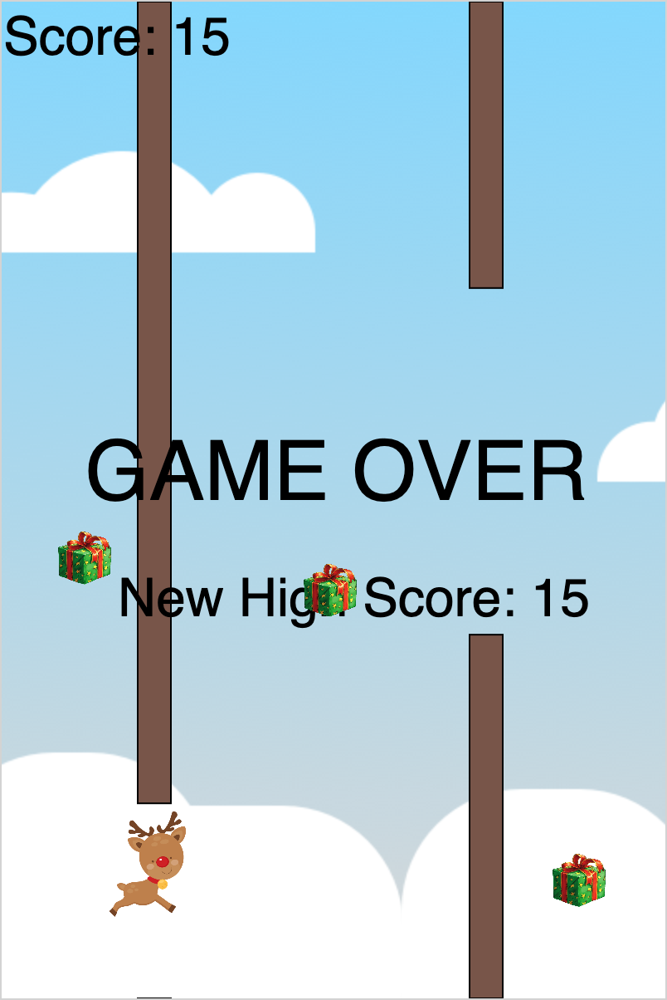

# Flappy Reindeer Game

This is a Flappy Reindeer Game. The basis of the game was created by following a [guide](https://github.com/netlight/codepub-ws-flappy-christmas-game) created by Netlight for the Code Pub.

  

---

### Development

The game was developed in [VS code](https://code.visualstudio.com/) using the [Live Server](https://marketplace.visualstudio.com/items?itemName=ritwickdey.LiveServer) extension.

**OBS!** Press "Go Live" in the bottom right corned of the VS Code editor.

### Features

#### Additions

- [x] Simple High Score
- [ ] Advanced High Score list (persistent, several users, etc.)
- [ ] Different levels
- [ ] Increased difficulty as game proceeds
- [ ] Start screen
